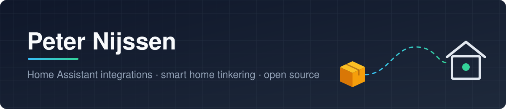

  

### Hi, I'm Peter 👋

I build things for my own house and share them when they might be useful to someone else. Most of what you'll find here is Home Assistant related: custom integrations, ESPHome configs and the occasional app. I write about my setup on [Yet Another Smart Home](https://yetanothersmarthome.com/).

### 📦 What I'm working on

**[Home Assistant Parcel Integrations](https://github.com/ha-parcel-integrations)** — a suite of custom integrations that track your parcels across carriers, all speaking the same data contract so one dashboard or automation works for every carrier. An aggregator merges them into a single view. → [ha-parcel-integrations.github.io](https://ha-parcel-integrations.github.io/)

  
  

### 🛠️ Other bits

🏠 [ha-postcodeloterij](https://github.com/peter-mdf/ha-postcodeloterij) — Postcode Loterij results in Home Assistant

### 🧰 Usually working with

   

### 📈 Stats

<picture>
  <source media="(prefers-color-scheme: dark)" srcset="https://streak-stats.demolab.com?user=peter-mdf&hide_border=true&background=00000000&disable_animations=true&ring=38BDF8&fire=34D399&currStreakLabel=38BDF8&theme=dark">
  
</picture>

Everything here is a personal, spare-time project.
